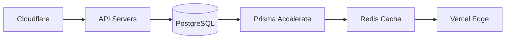

# Monet: Headless Loyalty Platform PRD  
**Technical & Business Blueprint**  

---

## 1. Product Overview  
Monet is a next-generation, API-first loyalty platform designed to help businesses rapidly deploy and scale personalized rewards programs. Key capabilities include:
- **10-minute white-label launch** via `*.loyaltystudio.ai` subdomains.
- **Multi-tenant, highly secure architecture** with RBAC.
- **Plug-and-play integrations** with 50+ commerce platforms.
- **Enterprise-scale processing**, handling 100M+ transactions/month with real-time insights.
- **Developer-first approach** with SDKs, API docs, and CLI tools.

---

## 2. Core Objectives  
| Priority | Objective                      | Success Metric                     |
|----------|--------------------------------|------------------------------------|
| P0       | <15 min merchant onboarding   | 95% completion rate               |
| P1       | 99.99% API uptime             | SLO adherence via Better Stack    |
| P2       | SDK adoption >80%             | Active usage + npm downloads      |
| P3       | <5ms authentication latency   | APM traces & monitoring           |

---

## 3. Technical Architecture  

### 3.1 Stack Components  
| Layer              | Technology       | Version | Purpose                          |
|--------------------|------------------|---------|----------------------------------|
| API Gateway        | Fastify          | v5      | High-performance endpoints & business logic |
| Auth & Real-time   | Supabase         | v2      | Authentication & real-time features |
| Frontend           | Next.js          | 15      | Admin & Merchant Dashboards      |
| Database           | PostgreSQL       | 14+     | Multi-tenant reward storage      |
| ORM                | Prisma           | 5.12    | Scalable database abstraction    |
| Cache             | Redis            | Latest  | Low-latency session caching      |
| Background Jobs    | Trigger.dev      | 3.12    | Event-driven workflows          |
| Monitoring         | Better Stack     | OSS     | Unified logs, metrics, tracing  |
| Monorepo           | Turborepo        | 2.9     | Optimized builds with caching   |

### 3.2 Repository Structure  
```bash
monet/
├─ apps/
│  ├─ api/               # Fastify API Gateway (PORT 3001)
│  │  ├─ src/
│  │  │  ├─ auth/       # Supabase authentication
│  │  │  ├─ db/         # Prisma database
│  │  │  ├─ routes/     # API endpoints
│  │  │  ├─ services/   # Business logic
│  │  │  ├─ middleware/ # Custom middleware
│  │  │  └─ supabase/   # Supabase client & utilities
│  ├─ admin-portal/      # Next.js Admin (PORT 3002)
│  ├─ merchant-web/      # Next.js Merchant App (PORT 3003)
│  ├─ docs/              # Public Documentation Site (PORT 3000)
│  ├─ web/               # Landing & Marketing Pages (PORT 3004)
├─ packages/
│  ├─ ui/                # Shadcn components
│  ├─ schemas/           # Zod validation
│  ├─ client-sdk/        # OpenAPI-generated client
└─ turbo.json            # Build pipeline config
```

### 3.3 Documentation Strategy
- **Unified API Documentation** (Using Scalar):
  - Combined Fastify + Supabase endpoints
  - Interactive API playground
  - Authentication guides
  - Rate limiting info
  - Webhook documentation
  - Available at `/api/docs`
- **Public Documentation Site** (`apps/docs`): 
  - Platform overview and features
  - Getting started guides
  - Integration tutorials
  - Best practices
  - Pricing and plans
  - Built with Next.js and MDX
- **Marketing Site** (`apps/web`):
  - Landing pages
  - Product features
  - Customer testimonials
  - Blog and resources
  - Contact information
  - SEO-optimized content

---

## 4. Key Features  

### 4.1 Merchant-Facing  
| Feature               | Implementation               | Phase  |
|-----------------------|----------------------------|--------|
| Subdomain Provisioning| DNS-as-Code (Cloudflare)   | Launch |
| Reward Rule Builder   | React Flow + Zustand       | Launch |
| Real-time Analytics   | ClickHouse + Better Stack  | Phase 2 |
| Webhook Studio        | Trigger.dev Visual Builder | Phase 1 |

### 4.2 Developer Experience  
- TypeScript SDK with React hooks.
- Scalar API documentation with OpenAPI 3.0.
- Better Stack-based error replay.
- Localstack integration for seamless local development.

---

## 5. Development Workflow  

### 5.1 Turbo Pipeline  
```json
{
  "pipeline": {
    "build": {
      "dependsOn": ["^build"],
      "outputs": [".next/**", "dist/**"]
    },
    "test": {
      "inputs": ["src/**/*.test.ts"]
    },
    "lint": {
      "cache": false
    }
  }
}
```

### 5.2 Local Development  
```bash
# Start all services
turbo dev --filter=api,merchant-web

# Test API health
curl -H "Host: acme.loyaltystudio.ai" http://localhost:3001/health
```

---

## 6. Security & Compliance  

### 6.1 Security Measures  
| Layer              | Protection                   | Tool               |
|--------------------|------------------------------|--------------------|
| Network            | DDoS protection              | Cloudflare         |
| Data               | AES-256 encryption           | AWS KMS            |
| Auth               | JWT refresh rotation         | Supabase           |
| Logging           | SOC2-ready audit trails      | Better Stack       |

### 6.2 Compliance Roadmap  
- **SOC 2 Type II** (Q3 2024)  
- **PCI DSS Level 1** (Q4 2024)  
- **ISO 27001** (Q1 2025)  
- **GDPR / CCPA readiness** (Ongoing)  

---

## 7. Deployment Strategy  

### 7.1 Infrastructure  


### 7.2 Observability Stack  
- **Metrics:** Better Stack  
- **Logs:** Better Stack + ClickHouse  
- **Traces:** Better Stack OpenTelemetry  

---

## 8. Roadmap  

### Q3 2024 (Launch)  
- Streamlined merchant onboarding.  
- Core loyalty APIs.  
- Shopify/WooCommerce integrations.  

### Q4 2024 (Scale)  
- Mobile SDK release.  
- AI-driven campaign optimization.  
- Enhanced fraud detection.  

### Q1 2025 (Enterprise)  
- Dedicated clusters.  
- Custom compliance packs.  
- SLA-backed enterprise support.  

---

## 9. Success Metrics  
| KPI                  | Target            | Measurement               |
|----------------------|-------------------|---------------------------|
| API Latency          | <50ms p95         | Better Stack APM          |
| Deployment Frequency | 50/day            | GitHub Actions            |
| Lead Time            | <2hrs             | CI/CD pipeline metrics    |
| Incident Recovery    | <15min MTTR       | Better Stack alerts       |

---

## 10. Cost Analysis  

### Development  
| Component         | Cost/Month       | Notes                      |
|-------------------|------------------|----------------------------|
| Engineering       | $120k            | 6 FTEs                     |
| Cloud Infra       | $18k             | AWS + Vercel               |
| Observability     | $0 (Free Tier)   | Better Stack OSS           |

### ROI Projection  
- 12-month payback period.  
- 38% gross margins.  
- $1.5M ARR at GA.  

---

